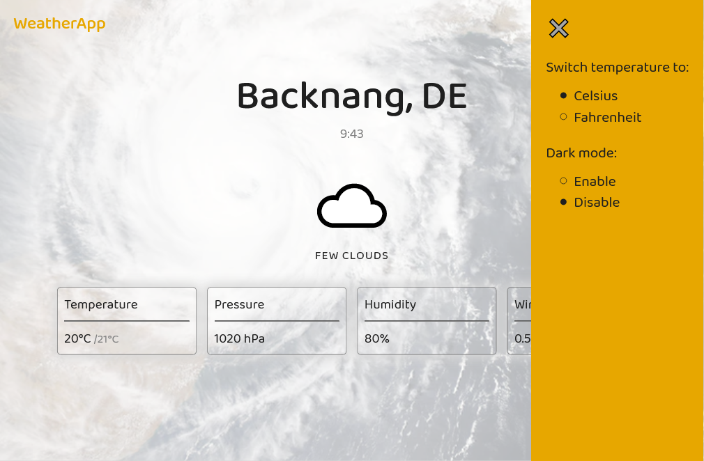

# Weather App

Application for fetching weather data for the current location. This is an enhanced solution to the [_Show the local weather_ Challenge](https://www.freecodecamp.org/learn/coding-interview-prep/take-home-projects/show-the-local-weather) by [freeCodeCamp](https://www.freecodecamp.org).

## Table of contents

-   [Challenge](#challenge)
-   [Links](#links)
-   [Technologies](#technologies)
-   [Wokflow](#workflow)
-   [Sources](#sources)
-   [Screenshots](#screenshots)
-   [Author](#author)

## Challenge

Objective: Build a CodePen.io app that is functionally similar to this [solution](https://codepen.io/freeCodeCamp/full/bELRjV).

### User stories:

-   I can see the weather in my current location.
-   I can see a different icon or background image (e.g. snowy mountain, hot desert) depending on the weather.
-   I can push a button to toggle between Fahrenheit and Celsius.
-   I can switch between dark and light mode. _(Bonus feature not included in the challenge)_

## Links

-   [Demo](https://codepen.io/toni00/full/ExZzXRN)
-   [CodePen - Source Code](https://codepen.io/toni00/pen/ExZzXRN)
-   [GitHub repository](https://github.com/tkulic/weather-app)

## Technologies

-   HTML5
-   CSS3
-   Vanilla JS
-   Geolocation API

## Workflow

1. Project initialization as a public repository on GitHub
2. Planning out HTML structure and CSS classes
3. Writing out HMTL and preparing it for DOM interactions with JavaScript
4. Styling the page from top to bottom by utilizing _mobile-first_ approach
5. Adding media queries for desktop layout
6. Wiring up markup and script: implementing Geolocation and enabling user interactions
7. Taking the challenge a step further by adding dark mode switch to the options menu
8. Configuring repository to publish code with GitHub Pages

## Sources

-   Geolocation API: [MDN Web Docs](https://developer.mozilla.org/en-US/docs/Web/API/Geolocation_API)
-   [freeCodeCamp Weather API](https://weather-proxy.freecodecamp.rocks/)

## Screenshots

## Author

-   GitHub profile - [Toni Kulić](https://github.com/tkulic)
